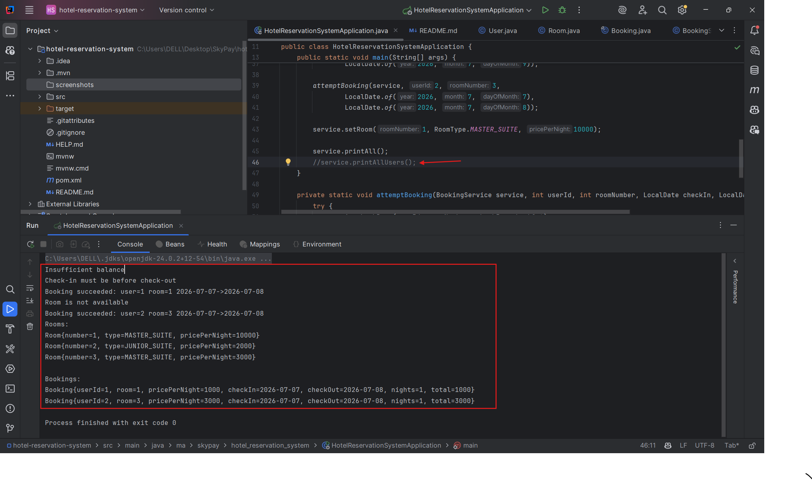
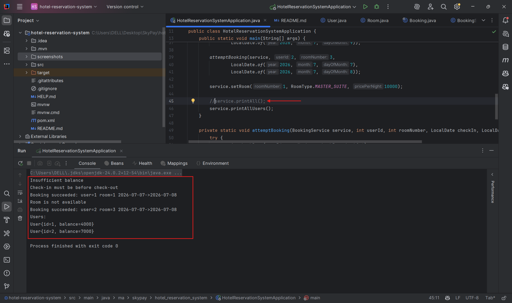
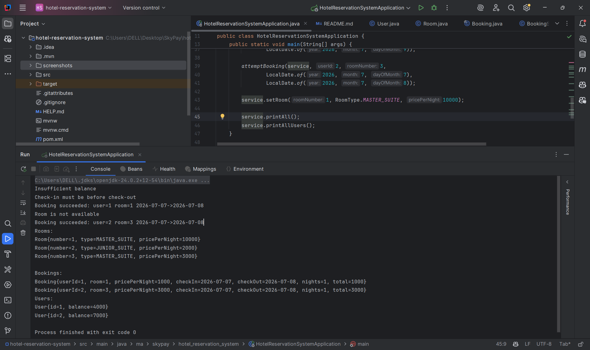

# Hotel Reservation System — Technical Test (SkyPay)

## Overview
This project is a small Java / Spring Boot technical demo that implements an **in-memory hotel reservation system**.  
It focuses on **clean domain modeling**, **business rules**, and **clear error handling**, without persistence or external dependencies.

The goal is to demonstrate backend design, booking logic, and code quality in a concise and readable way.

---

## Features
- User, Room, and Booking domain modeling
- Booking validation (date consistency, room availability)
- Overlap detection using half-open date intervals
- User balance validation before booking
- Clear business exceptions for invalid operations
- In-memory storage (no database)

---

## Technical Stack
- Java 17
- Spring Boot
- Maven
- Java Time API (`LocalDate`)

---

## How to Build
```
mvn clean package
```

## How to Run
- From IDE
Run the main method in:
HotelReservationSystemApplication.java

- From Command Line
If packaged as a runnable JAR:
java-jar target/hotel-reservation-system.jar

---

## Sample Execution
The demo performs several booking scenarios to illustrate:
- Successful booking
- Insufficient balance
- Invalid date ranges
- Room availability conflicts

### Print All


### Print All Users


### Combined Output


---

## Assumptions & Limitations
- In-memory storage: Data is lost on application exit
- No concurrency handling: Not thread-safe
- Money model: Uses int for simplicity (can be replaced with BigDecimal)
- No REST API: Console-based demo only
- No unit tests in the current version

## Possible Improvements
- Add REST endpoints (Spring Web)
- Add unit tests for BookingService (JUnit / Mockito)
- Introduce persistence (JPA / PostgreSQL)
- Add concurrency safety
- Replace money handling with BigDecimal

---

This project was designed as a compact technical test focusing on:
- Business logic correctness
- Code readability and structure
- Practical Java backend skills
It can be extended quickly with REST APIs, persistence, and tests if required.